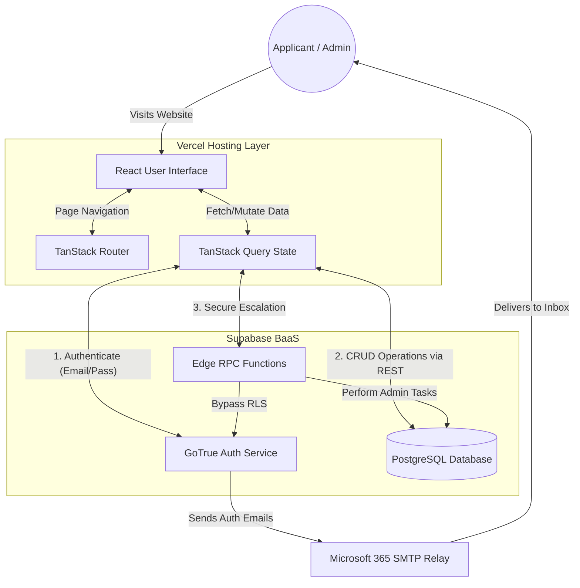
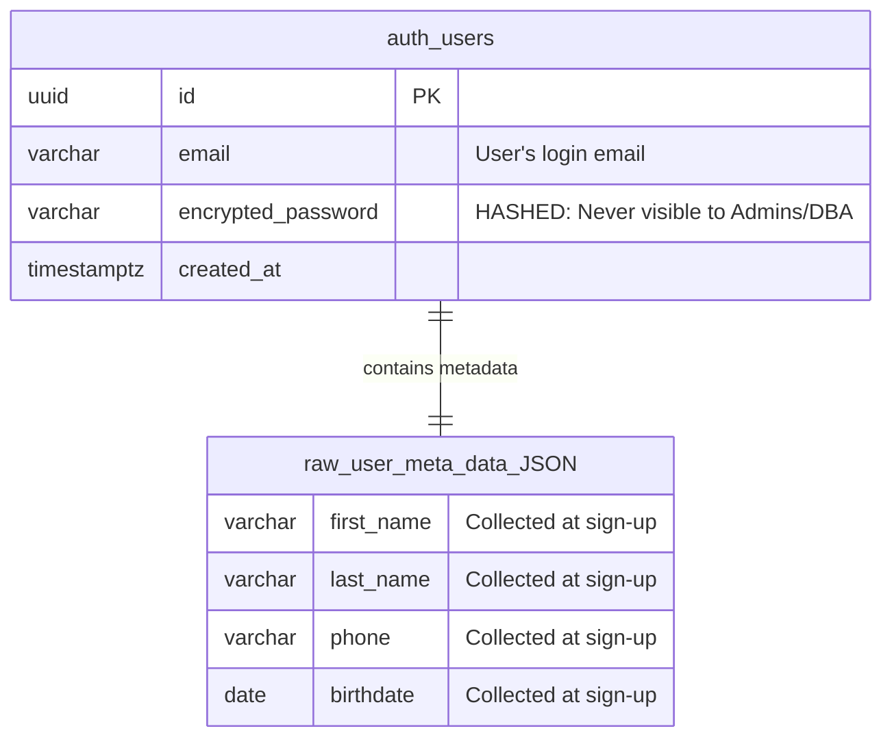
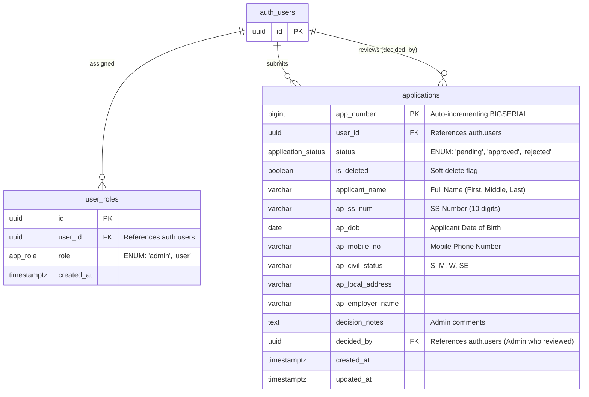

# Technical Specifications & Documentation

## 1. Overview & System Architecture
The SSS Housing Loan Portal is a modern, responsive web application that allows users to submit, edit, and manage their housing loan applications, while providing administrators with a secure dashboard to review, approve, or reject submissions.

### 1.1. High-Level System Flow
This diagram illustrates how the different components of the website interact to make the system run.

**How it works:**
1. **The User** accesses the web application, which is hosted globally and delivered quickly via **Vercel**.
2. **The Frontend (Vercel)** handles all visual components, strict form validations, and routing directly in the user's browser using React.
3. **The Backend (Supabase)** acts as the central data and identity hub. The frontend communicates with Supabase securely over the internet.
   - **Auth Service** handles login, registration, and password management.
   - **PostgreSQL DB** stores the loan applications and role data securely.
4. **Microsoft 365 SMTP Relay** acts as the secure email provider, reliably delivering system emails (like registration verification and password resets) from Supabase to the user's inbox.

---

## 2. Technical Specifications (Tech Stack)

### 2.1. Frontend & Hosting
* **Hosting Platform:** Vercel - Provides serverless edge hosting for fast global delivery and automatic CI/CD deployments.
* **Framework:** React 18
* **Build Tool:** Vite
* **Routing:** TanStack Router (`@tanstack/react-router`) - Provides type-safe file-based routing.
* **State Management & Data Fetching:** TanStack Query (`@tanstack/react-query`)
* **Styling:** Vanilla CSS with custom utility classes and design tokens. Strict adherence to the SSS color palette.

### 2.2. Backend & Database
* **Backend-as-a-Service (BaaS):** Supabase
* **Database:** PostgreSQL
* **Authentication:** Supabase Auth (GoTrue) - Manages JWT sessions and secure email/password sign-ins.
* **Security:** Row Level Security (RLS) policies to ensure data isolation. Custom PostgreSQL RPC functions are deployed for elevated tasks.

### 2.3. Data Validation
* **Schema Validation:** Zod (`zod`) - Guarantees strict type safety and schema validation.
* **Form Inputs:** Custom masked input components (e.g., `DigitBoxes`) intercept user keystrokes to ensure lengths and formats match the database requirements exactly.

---

## 3. Database Design

### 3.1. User Registration Data (Auth vs DB)
During registration, the website collects the user's **First Name**, **Last Name**, **Phone Number**, **Birthdate**, **Email**, and **Password**. 
* **Where does it go?** This information is passed directly to the Supabase **GoTrue Auth Service**.
* **Storage Details:** Supabase stores the Email securely, completely hashes the Password (so it is **never visible** to anyone, not even admins), and stores the demographic registration info (Name, Phone, Birthdate) inside a JSONB column called `raw_user_meta_data` inside the `auth.users` table. 
* **Admin Capabilities:** Admins cannot see or retrieve a user's password. They can only perform secure operations like Hard Deleting a user via custom RPC functions. Users are solely responsible for creating and changing their passwords securely via email reset flows.

### 3.2. Auth & Registration Entity-Relationship Diagram
Because Supabase handles authentication natively, the registration data is stored in the `auth.users` system table. The demographic information collected at sign-up is stored inside a JSONB column (`raw_user_meta_data`). This diagram conceptually breaks down the JSONB object to illustrate the specific user fields captured during registration.

### 3.3. Loan Applications Entity-Relationship Diagram
This diagram represents the actual Postgres database schema for storing submitted housing loan applications and managing user roles.

### 3.1. Database Security & Triggers
* **Row Level Security (RLS):** 
  * Users can only `SELECT` and `INSERT` their own applications.
  * Only users with an `admin` role in the `user_roles` table can `UPDATE` applications (for approving/rejecting).
  * Only admins can `DELETE` applications (soft delete).
* **Triggers:**
  * `trg_applications_updated_at`: Automatically updates the `updated_at` column whenever a row is modified.
  * `on_auth_user_created`: Automatically assigns the default `'user'` role to any new signups via the `handle_new_user()` function.

---

## 4. Source Code Architecture Details

### 4.1. Core Directory Structure
* `/src/routes/`: Contains the file-based routing components driven by TanStack Router.
  * `_authenticated/`: A layout route that enforces session checks. If no user is authenticated, it redirects to `/auth`.
    * `admin.tsx`: The administrative dashboard. Restricted by `checkIsAdmin()`.
    * `apply.tsx`: The primary creation form for housing loans.
    * `dashboard.tsx`: The user's personal queue of submitted applications.
    * `edit.$id.tsx`: The interface for editing a pending application. Pre-fills existing data.
    * `application.$id.tsx`: The read-only detailed view of an application, utilized by both users and admins.
    * `settings.tsx`: Security and profile management (password resets, email updates).
* `/src/lib/`:
  * `applications.functions.ts`: Encapsulates all backend interactions (fetching, inserting, updating applications, and checking roles).
  * `applications.schema.ts`: Contains the `zod` schema definitions reflecting the database constraints.
* `/src/components/`:
  * `DigitBoxes.tsx`: A highly complex UI component that forces precise alphanumeric input mapping to predefined formats (e.g., `##-#######-#`).
  * `SplitInputs.tsx`: Contains components like `SplitName` and `SplitAddress` that present an aggregate view but split data into exact segments behind the scenes.
  * `SssHeader.tsx`: The global navigation layout.

### 4.2. Complex Data Handling
The application demands extensive data entry across multiple domains (Principal Applicant, Spouse, and Employer).
* **Synthetic Data Generation:** For testing and rapid development, `apply.tsx` features a pre-fill engine that can map synthetic JSON data into the React state instantly.
* **Form State Sanitization:** Before data hits the database, the `cleanOptional` utility maps empty strings (`""`) to `null` to respect strict database checks without causing React controlled-component errors.

### 4.3. Routing & State Paradigm
* The application is fully client-side rendered (CSR).
* Page changes do not trigger full browser reloads.
* TanStack Query intelligently caches `is-admin` checks and application payloads to avoid redundant network calls, while still automatically re-fetching when mutations (like an Edit or Status Approval) occur.
